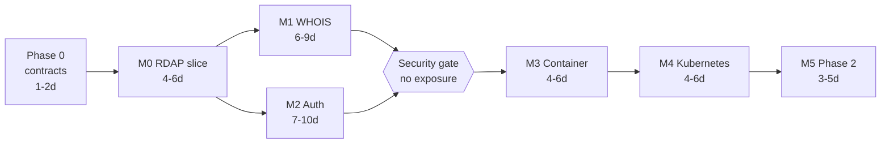

# WHOIS/RDAP MCP Server — Implementation Plan

| | |
|---|---|
| **Status** | Complete — Phase 0 and M0-M5 all landed (2026-08-19); §7 security gate closed |
| **Date** | 2026-08-19 |
| **Plans** | [`MCP_DESIGN.md`](MCP_DESIGN.md) (accepted, all open questions resolved) |
| **Covers** | Milestones M0 → M5 of design §15 |

This is the build order for the accepted design. It does not restate the design
or revisit its decisions — where this plan and `MCP_DESIGN.md` disagree, the
design wins and this document is the one that needs fixing.

Three things it adds that the design deliberately left out: the **order** work
must happen in and why, the **contracts that must exist before parallel work can
start**, and the **risks worth spending time on up front** rather than
discovering at integration.

---

## 1. Preconditions

Verified present on the development host as of 2026-08-19:

| Tool | Version | Needed for |
|---|---|---|
| Go | 1.26.6 (darwin/arm64) | Everything; design requires ≥1.24 |
| Docker | 29.6.1 | M3 |
| Helm | 4.2.0 | M4 |
| kubectl | (client present) | M4 |

Outbound **TCP/443 and TCP/43** are confirmed reachable (design §16, decision 3),
so no proxy workaround is needed and the WHOIS path can be developed directly.

Still to be provisioned, and each blocks the milestone named:

- A container registry to push to — blocks M3 delivery (not M3 development).
- A Kubernetes namespace and a test cluster — blocks M4.
- A DNS name and TLS certificate for the public URL — blocks M2 *end-to-end*
  testing, because OAuth redirect flows and `aud` validation are defined against
  the canonical HTTPS URI. Local development works around this with
  `WHOIS_MCP_DEV_STATIC_BEARER` on loopback (design §5.9).

---

## 2. Sequencing principles

Four rules determine the order below. They are worth stating because each one
overrides the "obvious" alternative ordering.

**Contracts before implementations.** `DomainReport`, the `Cache` interface, and
the resolver's function signatures are the join points between packages that
otherwise have no reason to touch each other. They are written first, in one
sitting, and changed rarely — because changing `DomainReport` after M1 means
touching both upstream parsers, the normalizer, the tool schemas, and every
golden fixture at once.

**Vertical slice before breadth.** M0 delivers one tool, one TLD family, one
protocol path — but end to end, from MCP request to normalized result. A working
narrow path flushes out the SDK's actual API shape, the JSON schema generation,
and the tool-result plumbing while there is almost no code to change. Building
all of `rdapx` before anything can call it inverts that.

**Hermetic tests from the first commit.** Every parser test runs against a
committed fixture, never the live network. This is not a testing nicety: registry
responses are the input format we are reverse-engineering, so captured fixtures
*are* the specification, and a test suite that needs the internet cannot run in
CI or on a plane. Fixture capture is therefore an M0 task, not an M1 one.

**Security gates precede exposure.** M0 and M1 have no authentication. They are
bound to loopback and are never containerized, published, or port-forwarded.
See §7 of this plan — this is the one sequencing rule with a real blast radius if ignored.

---

## 3. Phase 0 — Foundations

Everything here is a prerequisite for parallel work. It is small and should be
finished before anyone starts a milestone. **Size: ~1–2 days.**

| # | Task | Output |
|---|---|---|
| P.1 | `go mod init github.com/qjam/whois-mcp`; pin the SDK, `openrdap/rdap`, `x/net`, `x/crypto` | `go.mod`, `go.sum` |
| P.2 | Repository skeleton exactly as design §4.1 — every package a `doc.go` stating its one responsibility | `internal/*/doc.go` |
| P.3 | **Define `DomainReport`** and its sub-types from design §7, with JSON tags and `jsonschema` annotations | `internal/normalize/report.go` |
| P.4 | **Define the `Cache` interface** (`Get`/`Set`/`Delete`, TTL per entry) plus the in-memory implementation | `internal/cache/` |
| P.5 | **Define the resolver signature** — `Resolve(ctx, Query) (*DomainReport, error)` — and the `Source` enum | `internal/resolve/api.go` |
| P.6 | `internal/obs`: `slog` JSON to stderr, a `Redact()` helper for tokens/PII, no-op metric and tracer stubs | `internal/obs/` |
| P.7 | Makefile + `golangci-lint` config + GitHub Actions running `go test -race ./...` and `go vet` | `.github/workflows/ci.yml` |

**Exit criteria:** `make test` and `make lint` pass green on an empty test suite;
`DomainReport` round-trips through `encoding/json`; CI runs on push.

> **The one thing to get right here** is `DomainReport`. It is the contract
> between two upstream protocols, the normalizer, the tool schemas, and the
> agent's mental model. Design §7 specifies it fully — including the tri-state
> `registered` and the `redacted` flag — so this is transcription, not design.
> Resist adding fields "we'll probably need"; every field is a parser obligation.

---

## 4. M0 — Vertical slice (RDAP, gTLDs, no auth)

**Goal:** an MCP client calls `domain_lookup("example.com")` over Streamable HTTP
and gets a populated `DomainReport`. **Size: ~4–6 days.**

| # | Task | Notes |
|---|---|---|
| 0.1 | `cmd/whois-mcp`: env config, `net/http` server, graceful shutdown | Loopback bind only until M2 |
| 0.2 | MCP server wiring: `mcp.NewServer(&mcp.Implementation{...}, nil)` and `mcp.NewStreamableHTTPHandler(getServer, &mcp.StreamableHTTPOptions{Stateless: true})` mounted at `POST /mcp` | `Stateless: true` is the design target (design §6); set it now, not later |
| 0.3 | Register `domain_lookup` via `mcp.AddTool[In, Out]` with typed structs | SDK generates the JSON schema from `jsonschema` struct tags |
| 0.4 | `internal/resolve`: input normalization — strip scheme/path/port/trailing dot, lowercase, IDNA2008 via `x/net/idna`, registrable domain via `x/net/publicsuffix` | Design §8.1. Pure functions, heavily table-tested |
| 0.5 | `internal/rdapx`: IANA bootstrap fetch + parse (`data.iana.org/rdap/dns.json`), 24 h cache, **snapshot embedded via `go:embed`** as cold-start fallback | Design §8.2 |
| 0.6 | `internal/rdapx`: registry RDAP query, RFC 9083 response decode | Wrap `openrdap/rdap`; do not hand-roll |
| 0.7 | `internal/normalize`: RDAP response → `DomainReport`, including jCard/vCard entity extraction and `redacted` detection | Design §7.1 |
| 0.8 | Tri-state availability from RDAP: 200 → `yes`, RDAP-shaped 404 → `no`, anything else → `unknown` | Design §8.6; the `unknown` branch is not optional |
| 0.9 | **Capture golden fixtures** for `.com`, `.org`, `.dev`, plus one unregistered and one redacted response | `testdata/rdap/` |
| 0.10 | `httptest`-based fake RDAP server driven by fixtures; all tests hermetic | |

**Exit criteria (met 2026-08-19):** MCP Inspector connects to `http://127.0.0.1:8080/mcp`,
`tools/list` returns `domain_lookup` with a valid schema, and a lookup of a
registered `.com`, an unregistered domain, and an IDN each return a correct
`DomainReport` — with the whole suite passing offline.

---

## 5. M1 — WHOIS fallback and coverage

**Goal:** any TLD resolves, including the ccTLDs that have no RDAP service.
**Size: ~6–9 days, with the widest variance of any milestone (see the risk register, §12).**

| # | Task | Notes |
|---|---|---|
| 1.1 | `internal/whois`: port-43 transport — dial, write `domain\r\n`, read to EOF, all under `context` deadlines, with a response size cap | Design §8.4 |
| 1.2 | TLD → WHOIS host discovery via `whois.iana.org`, cached 24 h alongside the bootstrap map | |
| 1.3 | Referral chain following, max 2 hops, cycle-detected | |
| 1.4 | Per-TLD **quirks table** — query prefixes such as `.de`'s `-T dn,ace` and `.jp`'s `/e` — as data, not branching code | Design §8.4; keeping this a table is what stops it rotting |
| 1.5 | Template parsers for the ~40 highest-traffic WHOIS hosts, table-driven (label → field, date layout) | `internal/whois/parsers/` |
| 1.6 | Heuristic fallback parser + synonym map, emitting `parse_confidence` | Design §8.5 |
| 1.7 | "Not found" signature list per registry → tri-state `registered` | Design §8.6 |
| 1.8 | Registry → registrar RDAP referral following (max 1 hop, degrade to registry-only + warning) | Design §8.3 |
| 1.9 | `domain_availability` tool (batch ≤ 50, skips referrals, tighter timeout) | Design §6.1 |
| 1.10 | `tld_info` tool + `whois://bootstrap/tlds` resource | Design §6.1–6.2 |
| 1.11 | Fake port-43 listener for tests: slow, truncated, malformed, rate-limited modes | |
| 1.12 | Golden fixtures per parsed registry, including "not found" variants | `testdata/whois/` |

**Exit criteria:** the TLD matrix from design §14 (`.com .org .uk .de .jp .io .dev
.xn--p1ai`, one RDAP-less TLD, one IANA-listed-but-dead TLD) resolves correctly
or degrades to `unknown` with a warning — never to a wrong `yes`/`no`. Suite
still hermetic.

---

## 6. M2 — Authentication

**Goal:** the fixed enrollment token, entered in a browser, yields per-session
tokens; `/mcp` rejects everything else. **Size: ~7–10 days. This is the largest
bespoke-code milestone and the one where mistakes are most expensive.**

### 6.1 What the SDK gives us for free

The resource-server half is largely provided by
`github.com/modelcontextprotocol/go-sdk/auth`:

| Provided | Use |
|---|---|
| `func RequireBearerToken(verifier TokenVerifier, opts *RequireBearerTokenOptions) func(http.Handler) http.Handler` | The `/mcp` middleware. Handles the 401 + `WWW-Authenticate` challenge shape |
| `type TokenVerifier func(ctx, token string, req *http.Request) (*TokenInfo, error)` | Our hook: verify our JWT, return scopes + expiry |
| `type TokenInfo struct { Scopes []string; Expiration time.Time; UserID string; Extra map[string]any }` | Carries `sid` and scopes into request context |
| `func ProtectedResourceMetadataHandler(*oauthex.ProtectedResourceMetadata) http.Handler` | Serves `/.well-known/oauth-protected-resource` (RFC 9728) |
| `RequireBearerTokenOptions{ResourceMetadataURL, Scopes, ClockSkew, ...}` | Wires the challenge to our PRM document and required scopes |

**Do not reimplement any of the above.** Verify these signatures against the
pinned SDK version before building on them; they are current as of v1.7.0.

### 6.2 What we build

The **authorization-server** half is ours — the SDK's `OAuthHandler` and
`AuthorizationCodeHandler` are client-side and do not help here.

| # | Task | Notes |
|---|---|---|
| 2.1 | Ed25519 keypair load/generate; JWKS document at `/.well-known/jwks.json` with `kid` | Rotation-ready from the start; retrofitting `kid` later invalidates live tokens |
| 2.2 | Access-token mint + verify: EdDSA JWT, claims per design §5.3, 10 min TTL | Verification is local, no store read — this is what makes replicas stateless |
| 2.3 | `TokenVerifier` implementation: signature, `exp`, **`aud` equals our canonical URI**, scope extraction | `aud` validation is the confused-deputy defence (design §5.4); it is a one-line check that must not be skipped |
| 2.4 | Session store behind an interface; memory impl now, Redis at M3 | Sessions: `sid`, label, created, last-seen, refresh-token family |
| 2.5 | Refresh tokens: opaque 256-bit, **rotating, one-time-use, sliding 30-day window**; reuse detection revokes the whole family and alerts | Design §5.3. The reuse-detection branch needs its own test |
| 2.6 | Revocation denylist keyed by `sid`, TTL = access-token lifetime, checked on the hot path | Bounds revocation latency to 10 min without a per-request DB read |
| 2.7 | Enrollment secret: Argon2id hash at startup, constant-time compare, per-IP rate limit with exponential lockout, audit log that never records the token | Design §5.7 |
| 2.8 | `/oauth/authorize`: the enrollment web form; PKCE S256 challenge capture; `resource` parameter; issues code + `iss` | Design §5.2 |
| 2.9 | `/oauth/token`: code exchange with PKCE verifier validation, and the refresh-rotation grant | |
| 2.10 | `/oauth/revoke` (RFC 7009); `/oauth/register` (DCR, back-compat only) | |
| 2.11 | AS metadata at `/.well-known/oauth-authorization-server` (RFC 8414), incl. `authorization_response_iss_parameter_supported: true` | |
| 2.12 | `internal/web`: enrollment UI, `go:embed` templates, no framework, no build step | |
| 2.13 | Scopes `whois:read` / `whois:raw` / `whois:admin`; 403 + `insufficient_scope` challenge for step-up | Design §5.5 |
| 2.14 | `rdap_raw`, `whois_raw` tools behind `whois:raw`; `session_list` / `session_revoke` behind `whois:admin` | |
| 2.15 | `WHOIS_MCP_DEV_STATIC_BEARER`, refusing to start unless bound to loopback | Design §5.9 |

**Exit criteria:** a real MCP client completes the full flow — 401 → PRM
discovery → AS metadata → browser enrollment → code + PKCE exchange → `/mcp`
with a Bearer token. Tokens minted for a different `aud` are rejected; a reused
refresh token kills the family; a `whois:raw` call with only `whois:read`
returns 403 with a scope challenge.

---

## 7. Security gate between M1 and M2

M0 and M1 produce a **fully functional, completely unauthenticated** WHOIS/RDAP
service. Exposed to a network it is an open proxy that queries registries using
our egress IP — and per design §16 decision 4 we have no registry agreement, so
abuse through it lands on us as a block against our own address, presenting as a
total outage for the affected TLD.

Concretely, until M2 lands:

- Bind to `127.0.0.1` only; the listen address is not configurable to anything
  else while the auth middleware is absent.
- No container image is built, pushed, or run with a published port.
- No `kubectl port-forward`, no ngrok, no "quick demo" on a shared host.

The first task of M3 is to assert this is no longer true — the image must fail
to start without `WHOIS_MCP_ENROLLMENT_TOKEN`, and `readyz` must fail if auth is
disabled while bound to a non-loopback address.

---

## 8. M3 — Container and resilience

**Goal:** a hardened image that behaves under load and failure. **Size: ~4–6 days.**

| # | Task | Notes |
|---|---|---|
| 3.1 | Startup guard: refuse non-loopback bind without an enrollment token configured | Closes the §7 gate of this plan |
| 3.2 | Multi-stage Dockerfile → `distroless/static:nonroot`, `CGO_ENABLED=0`, read-only rootfs | Design §11.2 |
| 3.3 | Redis implementations of `Cache` and the session store | Interfaces already exist from task P.4 / task 2.4 |
| 3.4 | `internal/ratelimit`: per-upstream token buckets, exact `Retry-After`, exponential backoff with full jitter | Design §9 |
| 3.5 | Circuit breaker per upstream host | Prevents one dead registry consuming the concurrency budget |
| 3.6 | Singleflight collapsing of concurrent identical queries | Design §9 |
| 3.7 | Cache TTL policy table (1 h / 5 min / 60 s / 24 h) and `max_age_seconds` bypass | Design §9 |
| 3.8 | Prometheus metrics per design §12; OTel tracing with `_meta` trace-context propagation | |
| 3.9 | `compose.yaml` with Redis for integration testing of the shared-cache path | |
| 3.10 | CI: build image, run compose, execute an end-to-end enrollment + lookup test | |

**Exit criteria:** `docker compose up` yields a working enrolled lookup against
Redis-backed cache; a fake registry returning 429 with `Retry-After` is honoured
exactly; killing one upstream trips its breaker without affecting other TLDs.

---

## 9. M4 — Kubernetes

**Goal:** `helm install` produces a horizontally scalable deployment.
**Size: ~4–6 days.**

| # | Task | Notes |
|---|---|---|
| 4.1 | Chart scaffold, `values.yaml`, `NOTES.txt` documenting the enrollment flow | |
| 4.2 | Deployment ≥2 replicas, no PVC; Secret for enrollment token **and the shared Ed25519 signing key** | The signing key **must** be identical across replicas or tokens fail on whichever replica did not mint them |
| 4.3 | Service, Ingress with TLS; HTTP refused outside loopback | |
| 4.4 | **NetworkPolicy allowing egress on 443 *and* 43** | Design §11.3. Omitting 43 breaks every ccTLD and reads like a parser bug — this is the single highest-value line in the chart |
| 4.5 | HPA on CPU + in-flight requests; PodDisruptionBudget | |
| 4.6 | `/healthz` liveness; `/readyz` gated on bootstrap map loaded and cache reachable | |
| 4.7 | JWKS key rotation runbook — publish new `kid`, wait one access-token TTL, retire old | |
| 4.8 | `ServiceMonitor` when the Prometheus operator is present | |

**Exit criteria:** two replicas serve interchangeably with a token minted by
either; a ccTLD lookup succeeds through the ingress, proving port 43 egress;
scaling to zero and back loses no session.

---

## 10. M5 — Phase 2 surface

**Size: ~3–5 days, and explicitly deferrable.** `ip_lookup` / ASN lookups via the
RIRs, batch-availability tuning, and per-TLD quirks expansion driven by whatever
the M1 fixture work showed to be missing. Nothing depends on this; it is the
first thing to cut if the schedule compresses.

---

## 11. Critical path

**M1 and M2 are independent** once M0 lands — WHOIS parsing touches
`internal/whois` and `internal/normalize`; auth touches `internal/auth` and
`internal/web`. They share only `cmd/whois-mcp` wiring and the `Cache`
interface, both fixed in Phase 0. With two engineers this is the one place real
parallelism exists, and it removes roughly a week from the serial path.

Serial total is roughly **29–44 engineer-days**; parallelizing M1/M2 brings the
calendar path to about **23–34 days**. Treat these as relative sizes, not
commitments — the risk register (§12) explains which one will move.

---

## 12. Risk register

| Risk | Likelihood | Impact | Response |
|---|---|---|---|
| **WHOIS parsing is an unbounded long tail** | High | Schedule | The dominant estimate risk. Timebox M1 template parsers to the ~40 highest-traffic hosts and let the heuristic parser plus `parse_confidence` carry the rest — the schema already models "we parsed this poorly". Do **not** chase 100% coverage before M2 |
| **Getting the OAuth AS subtly wrong** | Medium | Security | Highest-consequence risk. Mitigations: use the SDK for the resource-server half; write the `aud`-rejection and refresh-reuse tests *before* the implementation; run a focused security review of `internal/auth` as an M2 exit gate rather than at the end |
| **Accidental exposure before M2** | Medium | Severe | §7 of this plan. Enforced in code by the startup guard, not by discipline alone |
| **Registry rate-limiting or IP block during development** | Medium | Blocks a TLD | Fixture-first testing means development does almost no live querying. Live smoke tests stay nightly and small (design §14) |
| **Signing key not shared across replicas** | Medium | Outage at M4 | Caught by the M4 exit criterion "token minted by either replica works on both"; make that an automated test, not a manual check |
| **`DomainReport` churn after M1** | Medium | Rework | Phase 0 transcribes it fully from design §7 up front; changes after M0 require touching both parsers and every fixture |
| **IANA bootstrap unavailable at cold start** | Low | Startup failure | Embedded snapshot (task M0 0.5); staleness is logged and surfaced in `tld_info`, never fatal |
| **SDK API drift** | Low | Rework | Pin the SDK version in `go.mod`; the spec's 12-month deprecation policy makes surprises unlikely |

### De-risking spikes, worth doing early

1. **Fixture-capture spike (½ day, during Phase 0).** Query the design's TLD
   matrix by hand and save the raw responses. This is the cheapest way to learn
   how bad the WHOIS long tail actually is, and it directly sizes M1 — the
   largest estimate uncertainty in the plan.
2. **SDK auth spike (½ day, before M2).** Wire `RequireBearerToken` with a
   hardcoded static token and confirm the 401 challenge and PRM discovery shape
   against a real MCP client. Confirms the borrowed half works before building
   the bespoke half against it.

---

## 13. Testing and CI

Per design §14, applied per milestone rather than deferred:

| Milestone | Tests that must land with it |
|---|---|
| Phase 0 | `DomainReport` JSON round-trip; CI green |
| M0 | Normalization table tests (IDN, case, subdomain, trailing dot, junk); RDAP parse against fixtures; fake RDAP server for 404/5xx/timeout |
| M1 | Per-registry parser goldens incl. "not found"; fake port-43 listener for slow/truncated/malformed; full TLD matrix; referral cycle detection |
| M2 | `aud` rejection; expired/malformed token; refresh rotation **and reuse detection**; PKCE enforcement; scope step-up 403; enrollment lockout |
| M3 | Rate-limit and `Retry-After` honouring; breaker open/close; singleflight collapsing; compose end-to-end |
| M4 | Cross-replica token validation; port-43 egress through the NetworkPolicy; probe behaviour |

CI runs `go test -race ./...`, `go vet`, and `golangci-lint` on every push, with
the container end-to-end job added at M3. **No test may require live network
access**; the nightly live smoke suite is a separate, non-blocking workflow so
registry flakiness never fails a merge.

---

## 14. Items needing a decision before the milestone they block

None of these block starting Phase 0.

1. ~~**Container registry and image naming** — before M3 delivery.~~ **Settled:**
   GHCR, in the repository's own namespace — `ghcr.io/<owner>/<repo>`, taken from
   `github.repository` so a transfer or rename follows automatically. Tags:
   `latest` and `sha-<commit>` on `main`, `X.Y.Z` and `X.Y` on a `v*` tag. The
   image is attached to the repository by `org.opencontainers.image.source`,
   asserted in CI.
2. **Target cluster, namespace, and ingress hostname** — before M4. The hostname
   is also the OAuth canonical URI and therefore the `aud` value, so it should be
   settled before M2's end-to-end testing rather than during M4.
3. **Redis: managed or in-cluster subchart** — before M3 task 3.3.
4. **Who owns the enrollment token** in production, and where it is stored
   (sealed secret, external secrets operator, manual) — before M4.
5. **Alerting destination** for refresh-token reuse detection (task 2.5), which
   is a credible theft signal and should page someone rather than only log.
