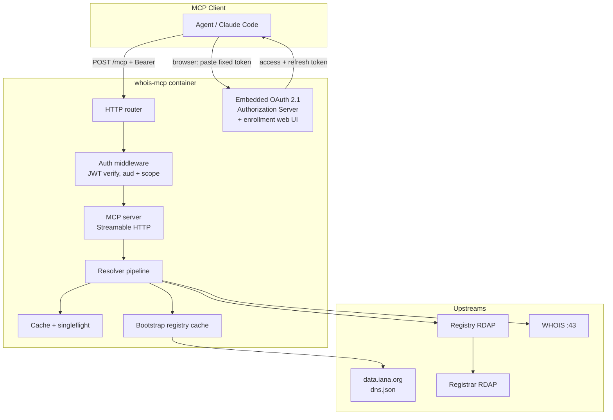
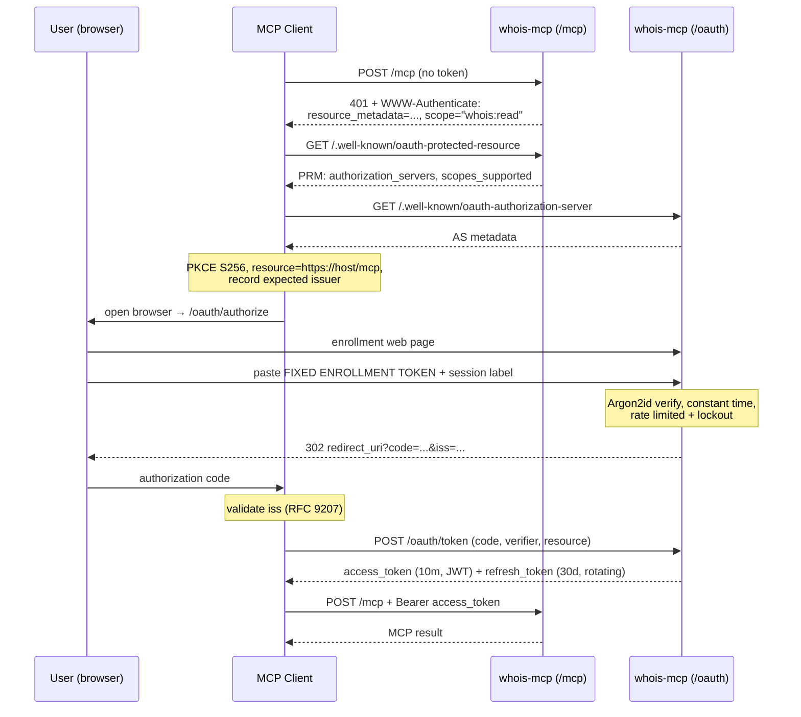
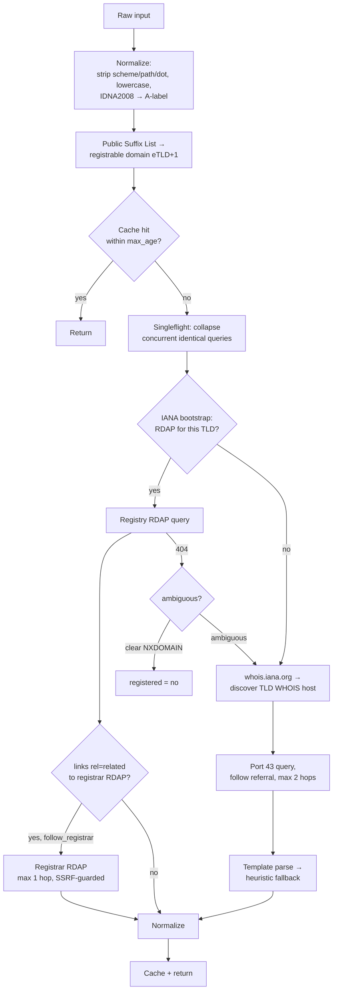

# WHOIS/RDAP MCP Server — Design Document

| | |
|---|---|
| **Status** | Accepted — all open questions resolved 2026-08-19 |
| **Author** | Michel Onstein |
| **Date** | 2026-08-19 |
| **Repo** | `github.com/qjam/whois-mcp` |
| **Target MCP revision** | `2026-07-28` (stateless core) — sole design target |
| **Tenancy** | Single tenant |

---

## 1. Purpose

Give an LLM agent a reliable, structured way to answer questions about domain
name registration: *is this domain registered, who holds it, who is the
registrar, when was it first registered, when does it expire, what are its
nameservers, is it locked or in redemption?*

The server exposes this as an MCP server over Streamable HTTP, protected by a
fixed enrollment token that a human pastes into a web page once; every
subsequent request uses a short-lived, per-session token.

### 1.1 Goals

- Query **any domain in any TLD** — gTLD, ccTLD, new gTLD, IDN.
- Prefer **RDAP** (structured, RFC 9083) and fall back to **WHOIS port 43**
  where RDAP does not exist.
- Return a **normalized, stable JSON schema** so the model does not have to
  parse 1,500 different registry text formats.
- Be **honest about uncertainty**: registration status is tri-state, contact
  redaction is reported explicitly, WHOIS parses carry a confidence signal.
- **Fixed-token enrollment via a web UI → per-session tokens** thereafter.
- Run natively for development, in Docker to start, on Kubernetes via Helm
  later — without changing application code.

### 1.2 Non-goals (initially)

- Domain registration, transfer, or any mutating registrar operation.
- Historical/passive WHOIS archives (that is a paid data-vendor product).
- Bulk zone-file analysis or brand-monitoring sweeps.
- Reverse WHOIS ("all domains owned by X") — not available from RDAP/WHOIS.

---

## 2. Language choice: Go

**Recommendation: Go 1.24+.**

### 2.1 Reasoning

**The workload is network fan-out with strict deadlines, not computation.**
A single `domain_lookup` may involve: an IANA bootstrap check, a registry RDAP
call, a registrar RDAP referral, and — on ccTLDs — a raw TCP connection to port
43 plus a referral to a second WHOIS host. Each hop needs its own timeout, its
own retry budget, and the whole chain needs a hard ceiling. Go's
`context.Context` propagates cancellation and deadlines through every layer of
`net/http` and `net.Dialer` as a first-class language idiom, and goroutines make
"race the RDAP call against the WHOIS fallback" a five-line function rather than
an async framework exercise.

**WHOIS is a raw TCP protocol, not HTTP.** RFC 3912 is "open a socket to port
43, write a line, read until EOF". Go's `net` package does this directly, with
the same context/deadline plumbing as the HTTP path. In Python or Node this
means dropping to a lower-level socket API that does not share the ergonomics or
the cancellation model of the HTTP client; in Go it is the same standard
library.

**Deployment target is a container, then Kubernetes.** Go compiles to a single
statically-linked binary with no runtime, no interpreter, and no dependency tree
shipped into the image. The production image is `distroless/static:nonroot` at
roughly 15–25 MB total with an effectively zero-package attack surface — no
`node_modules`, no `pip` wheels, no libc CVE stream to patch. Cold start is
milliseconds, which matters for HPA scale-out and for scale-to-zero. Idle
memory sits in the tens of megabytes, so replica count is cheap.

**The official Go MCP SDK is stable and current.**
`github.com/modelcontextprotocol/go-sdk` reached v1.0.0 with an explicit
no-breaking-changes guarantee and is maintained in collaboration with Google.
v1.7.0 shipped on 2026-07-28 — the same day as the `2026-07-28` specification —
with full support for the stateless core, `server/discover`, MRTR, and
`subscriptions/listen`, while still negotiating down to older revisions. It also
provides the OAuth pieces we need (`ClientCredentialsHandler`, token-source
persistence, issuer mix-up mitigation). We are not on the trailing edge of the
protocol by choosing Go.

**A mature RDAP library already exists.** `github.com/openrdap/rdap` implements
the client, full IANA bootstrapping (RFC 9224) for domains, IPs and ASNs, and
referral following — the exact resolution logic we would otherwise write and
maintain ourselves.

**Auth is stdlib work.** EdDSA signing, constant-time comparison, Argon2id
(`golang.org/x/crypto`), and a compliant `net/http` server with TLS are all
either standard library or `golang.org/x`. We are not pulling a framework in to
mint a JWT.

**Operational ecosystem alignment.** Prometheus, OpenTelemetry, and the entire
Kubernetes toolchain are Go-native, so metrics, tracing, and any future
controller work use first-party libraries.

### 2.2 Alternatives considered

| Language | Case for | Why not chosen |
|---|---|---|
| **TypeScript / Node** | Reference MCP SDK, usually first to implement new spec features; large talent pool | Runtime + `node_modules` in the image (100 MB+, continuous CVE churn); raw TCP for port 43 is awkward and does not share the HTTP client's cancellation model; per-replica memory is several times Go's, which is a real cost at k8s scale |
| **Python** | Best-known WHOIS parsing libraries; fast to prototype | Most popular WHOIS libraries shell out to the system `whois` binary or are unmaintained regex piles; concurrent fan-out means committing to asyncio and losing most of the sync ecosystem; packaging into a container is the least reproducible of the four; GIL is irrelevant for I/O but the deployment story is materially worse |
| **Rust** | Best performance and strongest safety story; small static binaries too | MCP SDK is less mature than Go's; no RDAP library at openrdap's level; the performance ceiling is irrelevant for a workload that spends 99% of its wall clock waiting on someone else's registry, and we would pay for it in development velocity |

Go sits at the intersection of *right protocol primitives*, *smallest secure
container*, *stable current-spec SDK*, and *an existing RDAP implementation*.
TypeScript is the sensible second choice if team familiarity dominates.

### 2.3 Key dependencies

| Dependency | Purpose |
|---|---|
| `github.com/modelcontextprotocol/go-sdk` | MCP server, Streamable HTTP transport |
| `github.com/openrdap/rdap` | RDAP client + IANA bootstrap + referral following |
| `golang.org/x/net/idna` | IDNA2008 A-label/U-label conversion |
| `golang.org/x/net/publicsuffix` | Registrable-domain (eTLD+1) extraction |
| `golang.org/x/crypto` | Argon2id for enrollment-token hashing |
| `github.com/go-jose/go-jose/v4` | JWT/JWS signing + JWKS |
| `go.opentelemetry.io/otel`, `prometheus/client_golang` | Tracing, metrics |
| `github.com/redis/go-redis/v9` | Shared cache + session store (k8s profile only) |

WHOIS port-43 transport and response parsing are written in-house — the
existing Go options are thin wrappers with weak parsing, and parsing is where
our value is.

---

## 3. Requirements

### 3.1 Functional

| ID | Requirement |
|---|---|
| F-1 | Look up any domain in any TLD and report whether it is registered |
| F-2 | Report registrar, registrant/admin/tech contacts (where disclosed), creation, update and expiry dates, nameservers, DNSSEC, and EPP status codes |
| F-3 | Prefer RDAP; fall back to WHOIS port 43 when a TLD has no RDAP service |
| F-4 | Follow registry → registrar referrals to obtain thick data |
| F-5 | Accept messy input: URLs, mixed case, trailing dots, Unicode IDNs, subdomains (reduced to the registrable domain) |
| F-6 | Expose raw upstream payloads behind a separate, more privileged scope |
| F-7 | Report per-TLD service capability (does this TLD have RDAP? which server?) |
| F-8 | Enrollment: operator-configured fixed token entered in a browser, exchanged for per-session credentials |

### 3.2 Non-functional

| ID | Requirement |
|---|---|
| N-1 | p95 latency ≤ 1.5 s warm cache-miss; ≤ 50 ms cache hit; hard ceiling 10 s |
| N-2 | Horizontally scalable — no replica-affine state on the request path |
| N-3 | Respect upstream rate limits; never become an abusive client of a registry |
| N-4 | No secrets, tokens, or contact PII in logs or traces |
| N-5 | Identical binary and configuration surface across dev, Docker, and k8s |
| N-6 | Graceful degradation: a dead registrar referral still yields registry data |

---

## 4. Architecture



### 4.1 Repository layout

```
cmd/whois-mcp/          entrypoint, flag/env wiring, graceful shutdown
internal/mcpsrv/        tool registration, schemas, MCP handlers
internal/auth/          enrollment, OAuth 2.1 AS, JWT mint/verify, sessions
internal/web/           enrollment UI (embedded templates + static assets)
internal/resolve/       orchestration: normalize → bootstrap → rdap → whois
internal/rdapx/         RDAP client wrapper, referral logic, SSRF guard
internal/whois/         port-43 transport, referral chain, parsers
internal/whois/parsers/ per-registry parse templates + golden fixtures
internal/normalize/     upstream shapes → canonical DomainReport
internal/cache/         Cache interface; memory + redis implementations
internal/ratelimit/     per-upstream token buckets, Retry-After handling
internal/obs/           logging, metrics, tracing
deploy/docker/          Dockerfile, compose for local integration
deploy/helm/whois-mcp/  chart
docs/MCP_DESIGN.md      this document
testdata/               golden RDAP/WHOIS fixtures per registry
```

---

## 5. Authentication and sessions

### 5.1 The constraint that shapes this

MCP `2026-07-28` **removed protocol-level sessions and the `Mcp-Session-Id`
header entirely**, along with the `initialize` handshake. The protocol is now
stateless: every request carries its own protocol version and capabilities in
`_meta`. Sessions cannot live at the MCP layer any more.

This is convenient rather than obstructive, because "per-session token" is an
*authorization* concept, not a transport one. We place the session in the OAuth
layer, which is where the spec expects identity to live: an MCP server is an
**OAuth 2.1 resource server**, and every HTTP request carries
`Authorization: Bearer <token>`.

### 5.2 How the fixed token becomes a session

The fixed token is an **enrollment secret**, not a request credential. It is
never sent to `/mcp`.



The browser form **is** the OAuth authorization endpoint's login page. This
satisfies the "fixed token entered in a web interface" requirement while
remaining a fully spec-compliant OAuth 2.1 flow, so off-the-shelf MCP clients
enroll without custom code.

### 5.3 Token design

**Access token** — EdDSA (Ed25519) signed JWT, 10-minute TTL, verified locally
by any replica with no store lookup:

```json
{
  "iss": "https://whois.example.com",
  "sub": "sess_01J8ZQ...",
  "aud": "https://whois.example.com/mcp",
  "sid": "sess_01J8ZQ...",
  "scope": "whois:read whois:raw",
  "exp": 1755600000,
  "iat": 1755599400,
  "jti": "..."
}
```

**Refresh token** — opaque 256-bit random, 30-day TTL, **rotating and
one-time-use**. Reuse of a consumed refresh token is treated as theft: the
entire token family is revoked immediately and the event is alerted on.

The 30 days is a **sliding window**: each rotation issues a fresh 30-day refresh
token, so an actively used session continues indefinitely while an idle one dies
30 days after its last use. This is deliberately both the session lifetime *and*
the inactivity timeout — a single rule rather than two competing ones. There is
no absolute cap; a session ends when it goes unused for 30 days or is explicitly
revoked.

**A session** is the token family created by one successful enrollment. It has
its own `sid`, label, creation time, last-seen time, and can be revoked
independently of every other session. This is precisely the requested "per
session tokens from that point onwards": the fixed token is used exactly once,
per client, and compromise of one session's tokens does not affect others.

### 5.4 Enforcement rules

- `aud` **must** equal this server's canonical URI (RFC 8707). Tokens minted for
  another resource are rejected — no confused-deputy.
- The server accepts **only** tokens it issued. It never forwards a client token
  upstream and never accepts a third-party token.
- Insufficient scope → `403` with `WWW-Authenticate: error="insufficient_scope",
  scope="whois:raw", resource_metadata=...` so the client can step up in one
  round trip.
- A short-TTL revocation denylist (keyed by `sid`, TTL = access-token lifetime)
  is consulted on the hot path so revocation takes effect within 10 minutes at
  worst, without a database read per request.

### 5.5 Scopes

| Scope | Grants |
|---|---|
| `whois:read` | Normalized lookups — `domain_lookup`, `domain_availability`, `tld_info` |
| `whois:raw` | Unredacted raw RDAP JSON and raw WHOIS text (`rdap_raw`, `whois_raw`) |
| `whois:admin` | Session listing and revocation |

`scopes_supported` in Protected Resource Metadata advertises the minimum
(`whois:read`); `whois:raw` is obtained through step-up authorization.

### 5.6 Endpoints

| Path | Purpose |
|---|---|
| `POST /mcp` | MCP Streamable HTTP endpoint (protected) |
| `/.well-known/oauth-protected-resource` | RFC 9728 PRM |
| `/.well-known/oauth-authorization-server` | RFC 8414 AS metadata |
| `/.well-known/jwks.json` | Public signing keys, supports rotation |
| `GET/POST /oauth/authorize` | Enrollment web UI (the fixed-token form) |
| `POST /oauth/token` | Code exchange + refresh rotation |
| `POST /oauth/revoke` | RFC 7009 revocation |
| `POST /oauth/register` | DCR, retained for older clients (deprecated in spec) |
| `GET /healthz`, `/readyz`, `/metrics` | Ops |

Client ID Metadata Documents are the preferred registration mechanism per the
`2026-07-28` spec; Dynamic Client Registration stays enabled for compatibility.

### 5.7 Brute-force and secret handling

The enrollment token is a 256-bit random string supplied by the operator via
env var or Kubernetes Secret. Only its **Argon2id hash** is held in memory;
comparison is constant time. The authorize endpoint is rate-limited per source
IP with exponential lockout, and every attempt — success or failure — is
audit-logged with the token itself never recorded.

### 5.8 Tenancy model

**Single tenant.** One enrollment token, one embedded authorization server, and
every session equally privileged. Sessions remain individually labelled and
individually revocable — that is what makes "who is still enrolled, and cut off
that one client" answerable — but they carry no distinct identity or per-user
policy, and any holder of the enrollment token can mint a session with any scope.

The consequence to be aware of: the enrollment token is the *only* real security
boundary, so it must be treated as a production secret and rotated if it is ever
exposed. Rotation invalidates nothing already issued, so it pairs with revoking
outstanding sessions.

The upgrade path, if multi-tenancy is needed later, is to replace the embedded
authorization server with an upstream OIDC provider and keep everything else —
the resource-server side (`aud` validation, scopes, JWT verification) is already
standard OAuth 2.1 and does not change. No storage migration is implied, because
sessions are not user-scoped today.

### 5.9 Development escape hatch

`WHOIS_MCP_DEV_STATIC_BEARER=true` allows the enrollment token to be presented
directly as a bearer token, skipping OAuth. It refuses to start unless the
listener is bound to loopback, and it is hard-disabled in the production image.
It exists so `curl` and early integration tests are not blocked on the browser
flow.

---

## 6. MCP surface

Transport is **Streamable HTTP** in stateless mode, targeting `2026-07-28`
**exclusively** — the stateless core is the design target, not a mode we opt into.
Nothing in the server holds per-connection state, which is what lets any replica
serve any request. `server/discover` advertises identity, supported protocol
versions, and capabilities.

The Go SDK still negotiates down to older revisions automatically; that
backward compatibility is inherited for free and is *not* a design constraint. We
do not add code, state, or test burden to preserve it, and `Mcp-Session-Id` is
ignored entirely. List results carry
`ttlMs` and `cacheScope: "public"` (the tool list is identical for every caller,
so clients and intermediaries may cache it) and are returned in a deterministic
order to help client-side prompt caching.

Roots, Sampling, and Logging are deprecated in `2026-07-28` and are not
implemented. Diagnostics go to stderr and OpenTelemetry.

### 6.1 Tools

| Tool | Scope | Purpose |
|---|---|---|
| `domain_lookup` | `whois:read` | Full normalized registration report |
| `domain_availability` | `whois:read` | Cheap registered / available / unknown check, optionally for a batch |
| `tld_info` | `whois:read` | Which registry serves a TLD, whether RDAP exists, which endpoint |
| `rdap_raw` | `whois:raw` | Verbatim RDAP JSON as returned upstream |
| `whois_raw` | `whois:raw` | Verbatim port-43 text, plus the referral chain walked |
| `ip_lookup` *(phase 2)* | `whois:read` | RDAP for IP addresses and ASNs via the RIRs |
| `session_list` / `session_revoke` | `whois:admin` | Session management |

#### `domain_lookup`

```jsonc
// input
{
  "domain": "string",                  // required; URL, IDN, subdomain all accepted
  "follow_registrar": true,            // fetch thick data via registry→registrar referral
  "include_contacts": true,            // include entity records (usually redacted)
  "prefer": "auto",                    // "auto" | "rdap" | "whois"
  "max_age_seconds": 3600              // caller's cache tolerance; 0 forces a fresh fetch
}
```

Output is the `DomainReport` in §7, returned both as `structuredContent` and as
a compact human-readable text block, so models that ignore structured output
still get usable content.

#### `domain_availability`

Takes `domains: string[]` (capped at 50 per call) and returns only
`{domain, registered, source, checked_at}` per entry. It exists because
"is `foo.dev` free?" should not pay for a registrar referral, entity parsing,
and a full payload — this path skips referral following entirely and has a
tighter timeout.

### 6.2 Resources

- `whois://bootstrap/tlds` — the current TLD → RDAP service map, with the
  bootstrap file's own publication timestamp. Useful for the model to reason
  about coverage before issuing a query it cannot answer well.

### 6.3 Errors

Tool-level failures return `isError: true` with a structured payload rather
than a JSON-RPC error, so the model can reason about and recover from them:

```jsonc
{ "error": "upstream_rate_limited",
  "tld": "de", "retry_after_seconds": 30,
  "message": "DENIC WHOIS rate limit; result may be available from cache" }
```

Error codes: `invalid_domain`, `unsupported_tld`, `no_service_for_tld`,
`upstream_timeout`, `upstream_rate_limited`, `upstream_unavailable`,
`parse_failed`, `response_too_large`.

---

## 7. Normalized data model

The single most valuable thing this server does is turn ~1,500 registry output
formats into one shape.

```jsonc
{
  "query": {
    "input": "https://WWW.Bücher.co.uk/path",
    "registrable_domain": "bücher.co.uk",           // U-label, reduced to eTLD+1
    "ascii": "xn--bcher-kva.co.uk",                 // A-label
    "tld": "uk",                                    // last label; how IANA keys the bootstrap file
    "public_suffix": "co.uk"                        // full suffix from the Public Suffix List
  },
  "registered": "yes",                 // "yes" | "no" | "unknown"  ← tri-state
  "registry_domain_id": "D503300000040...",
  "dates": {
    "created": "1999-08-14T04:00:00Z",
    "updated": "2025-07-09T09:12:33Z",
    "expires": "2026-08-14T04:00:00Z",
    "transferred": null,
    "timezone_assumed": false          // true when upstream gave no offset
  },
  "registrar": {
    "name": "Example Registrar, Inc.",
    "iana_id": 292,
    "url": "https://registrar.example",
    "abuse_email": "abuse@registrar.example",
    "abuse_phone": "+1.5555550100"
  },
  "statuses": ["clientTransferProhibited", "serverDeleteProhibited"],
  "status_meaning": {                  // EPP codes expanded for the model
    "clientTransferProhibited": "Registrar has locked the domain against transfer"
  },
  "nameservers": [
    { "host": "ns1.example.net", "ipv4": ["192.0.2.1"], "ipv6": [] }
  ],
  "dnssec": { "signed": true, "ds_records": 1 },
  "entities": [
    { "role": "registrant", "redacted": true,
      "reason": "GDPR/ICANN Temporary Specification",
      "name": null, "organization": "Example Ltd", "email": null,
      "country": "GB" }
  ],
  "source": {
    "protocol": "rdap",                // "rdap" | "whois"
    "servers": ["https://rdap.nominet.uk/uk/domain/...",
                "https://rdap.registrar.example/domain/..."],
    "fetched_at": "2026-08-19T09:31:02Z",
    "cache": "miss",
    "parse_confidence": 1.0,           // 1.0 for RDAP; 0.0–1.0 for WHOIS text
    "raw_available": true
  },
  "warnings": ["registrar referral timed out; registry data only"]
}
```

### 7.1 Deliberate modelling decisions

**`registered` is tri-state.** An RDAP `404` usually means "not registered", but
it also occurs when a server is misconfigured, blocks our IP, or is returning a
generic error page. Reporting `"unknown"` when the signal is ambiguous prevents
the agent from confidently telling a user a domain is free when it is not —
which is the single most damaging failure mode this server has.

**Redaction is data, not absence.** Post-GDPR, most gTLD contacts are redacted
by the registry. `{"redacted": true, "reason": ...}` tells the model *the data
exists but is withheld*, which is a different fact from *there is no registrant*.

**`parse_confidence` is exposed.** RDAP is structured and scores 1.0. WHOIS text
is parsed heuristically and the score reflects how much of the expected field set
matched a known template. The model can decide whether to trust a 0.4 parse or
fall back to quoting the raw text.

**Dates are always RFC 3339 UTC**, with `timezone_assumed` flagging the WHOIS
responses that gave a bare date with no offset.

---

## 8. Resolution pipeline



### 8.1 Input normalization

Strip scheme, userinfo, port, path and any trailing dot; lowercase; convert
Unicode to an A-label with **IDNA2008** (`golang.org/x/net/idna`, non-transitional).
Then reduce to the registrable domain using the **Public Suffix List** — without
this, `foo.example.co.uk` is queried as `co.uk` and every multi-label ccTLD
returns nonsense. Both the U-label and A-label are echoed back so the agent can
show the user what it actually looked up.

### 8.2 Bootstrap

IANA publishes `https://data.iana.org/rdap/dns.json` per RFC 9224. We fetch it
with `ETag`/`If-None-Match`, refresh every 24 h, and **bake a copy into the
container image** so a cold start with no egress to `data.iana.org` still
resolves the major TLDs. A stale bootstrap is logged and surfaced in
`tld_info`, never treated as fatal.

All gTLDs (~1,150) now provide RDAP; the gap is ccTLDs, which is precisely why
the WHOIS path is not optional.

### 8.3 RDAP path

Query the registry RDAP endpoint from the bootstrap map. For thick data, follow
`links` with `rel: "related"` and `type: "application/rdap+json"` to the
registrar's RDAP service — **at most one hop**, with a shorter timeout than the
registry call, and a failure there degrades to registry-only data plus a warning
rather than failing the request.

Using `rdap.org` as a universal front door was considered and rejected as a
default: it is a third party in the path for every query, adds a hop of latency,
and creates a single point of failure and of observation. It remains available
as an opt-in config for constrained egress environments.

### 8.4 WHOIS path

1. Query `whois.iana.org` for the TLD to learn its authoritative WHOIS host
   (cached 24 h alongside the bootstrap map).
2. Connect TCP/43, write `domain\r\n`, read to EOF under a deadline.
3. Follow a `Registrar WHOIS Server:` referral, **max 2 hops**, cycle-detected.
4. Parse.

Registry quirks handled explicitly: `.jp` and `.de` need `/e` or `-T dn,ace`
style query prefixes for English/ACE output; `.com` needs `domain ` prefixing on
some Verisign hosts; several ccTLDs enforce aggressive per-IP rate limits.
These live in a per-TLD quirks table, not scattered through the transport code.

### 8.5 Parsing WHOIS

Two tiers:

1. **Template parsers** keyed by WHOIS host, covering the ~40 hosts that serve
   the overwhelming majority of real queries. Each is table-driven
   (label → canonical field, plus a date layout) and backed by a golden fixture.
2. **Heuristic fallback** — generic `Key: Value` extraction with a synonym map
   (`Creation Date` / `created` / `Registered on` / `registered` → `created`),
   scoring `parse_confidence` by how much of the expected field set was found.

Raw text is always retained regardless of parse outcome, so `whois_raw` can
answer even when structured parsing fails.

### 8.6 Availability determination

Per-registry "not found" signatures (`No match for`, `NOT FOUND`, `Status: free`,
`No entries found`, `Domain not found`) are matched against the raw response;
RDAP relies on a `404` with an RDAP-shaped error body. Anything that does not
match a known signature — an empty response, an HTML error page, a 5xx, a
timeout — yields `registered: "unknown"` with a warning, never `"no"`.

---

## 9. Caching, rate limiting, resilience

**Cache** — interface with two implementations: in-process LRU for dev and
single-replica Docker; Redis for Kubernetes so replicas share warmth and
upstreams see a single logical client.

| Entry | TTL | Rationale |
|---|---|---|
| Registered domain report | 1 h | Registration data changes slowly; 1 h accepted incl. contact data (§13) |
| Unregistered result | 5 min | Availability is the volatile case |
| `unknown` result | 60 s | Retry soon; do not cement an error |
| IANA bootstrap / WHOIS host map | 24 h | Published daily |
| Raw payloads | 15 min | Larger; lower reuse |

`max_age_seconds: 0` on a tool call bypasses the read path (but still writes),
so an agent can force a fresh check after a registration.

**Singleflight** collapses concurrent identical in-flight queries into one
upstream request — important when an agent fans out across a list of candidate
domains that overlap.

**Rate limiting** is per upstream host: a token bucket with conservative
defaults. There is **no agreement with any registry or commercial WHOIS data
provider**, so we query registries directly as an anonymous client with no
negotiated quota and no contractual protection against being blocked. Every
limit below is therefore set to be defensibly polite rather than merely
functional, and cache hit rate is a primary operational metric, not a nicety —
it is the main lever keeping our query volume off registry radar. It follows
that `Retry-After` is honoured exactly, with exponential backoff and full
jitter on 429/5xx. A circuit breaker opens after sustained failures for one
upstream so a broken registry cannot consume the whole request-concurrency
budget. Being a well-behaved client is a hard requirement — registries block
abusive sources, and a block is effectively an outage for that TLD.

**Timeouts** — 2 s connect, 5 s per upstream request, 10 s whole-tool ceiling,
all context-propagated so a client disconnect cancels every in-flight upstream
call immediately.

---

## 10. Configuration

Environment variables (12-factor); a config file may override for local dev.

The listener is the one setting with a command-line form as well, because it is
the one routinely changed while running the binary by hand. Precedence, highest
last: default, `WHOIS_MCP_LISTEN`, `WHOIS_MCP_ADDRESS`/`WHOIS_MCP_PORT`,
`--listen`, `--address`/`--port`. Flags beat environment, and within a tier the
specific part beats the combined form — so `--listen 0.0.0.0:8080 --port 9000`
serves on `0.0.0.0:9000`.

Whichever path sets it, the resolved address goes through the §7 security gate:
binding anything but loopback requires an enrollment token.

| Variable | Default | Purpose |
|---|---|---|
| `WHOIS_MCP_LISTEN` | `127.0.0.1:8080` | Bind address as `host:port`; also `--listen` |
| `WHOIS_MCP_ADDRESS` | `127.0.0.1` | Bind address only; also `--address`. Overrides the address in `WHOIS_MCP_LISTEN` |
| `WHOIS_MCP_PORT` | `8080` | Port only; also `--port`. Overrides the port in `WHOIS_MCP_LISTEN` |
| `WHOIS_MCP_PUBLIC_URL` | — | Canonical URI; the OAuth `aud` and `resource` value |
| `WHOIS_MCP_ENROLLMENT_TOKEN` | — | The fixed token (Secret; hashed at startup) |
| `WHOIS_MCP_SIGNING_KEY` | — | Ed25519 private key (PEM); generated in dev if unset |
| `WHOIS_MCP_ACCESS_TOKEN_TTL` | `10m` | Access token lifetime |
| `WHOIS_MCP_REFRESH_TOKEN_TTL` | `720h` | Refresh token lifetime (30 d, sliding per §5.3) |
| `WHOIS_MCP_CACHE` | `memory` | `memory` \| `redis` |
| `WHOIS_MCP_REDIS_URL` | — | Redis DSN when `cache=redis` |
| `WHOIS_MCP_SESSION_STORE` | `memory` | `memory` \| `redis` \| `postgres` |
| `WHOIS_MCP_RDAP_BOOTSTRAP_URL` | IANA | Override for air-gapped mirrors |
| `WHOIS_MCP_RDAP_PROXY` | — | Unused: direct egress is available (§11.2) |
| `WHOIS_MCP_WHOIS_ENABLED` | `true` | Port 43 confirmed reachable; kept as a kill switch |
| `WHOIS_MCP_MAX_CONCURRENT_UPSTREAM` | `32` | Global upstream concurrency |
| `WHOIS_MCP_LOG_LEVEL` | `info` | Structured JSON to stderr |
| `WHOIS_MCP_OTEL_ENDPOINT` | — | OTLP collector |
| `WHOIS_MCP_DEV_STATIC_BEARER` | `false` | Loopback-only dev auth bypass |

---

## 11. Deployment

### 11.1 Development (native)

```bash
export WHOIS_MCP_PUBLIC_URL=http://localhost:8080
export WHOIS_MCP_ENROLLMENT_TOKEN=$(openssl rand -hex 32)
go run ./cmd/whois-mcp
```

In-memory cache and session store, ephemeral signing key, hot-reloadable
enrollment UI templates. `WHOIS_MCP_DEV_STATIC_BEARER=true` for `curl` testing.

### 11.2 Docker

Multi-stage: `golang:1.24` builder → `gcr.io/distroless/static:nonroot`.
`CGO_ENABLED=0`, trimmed and stripped, non-root UID, read-only root filesystem,
no shell in the final image. The IANA bootstrap snapshot and the embedded web
assets are compiled in via `embed`, so the image has no runtime file
dependencies. Expected size ~20 MB.

Egress required: **TCP 443** (RDAP, IANA) and **TCP 43** (WHOIS). Both are
**confirmed reachable** in the target environment, so the direct-query design
stands and `WHOIS_MCP_RDAP_PROXY` stays unused — no third party sits in the
query path. The port-43 rule still has to be written into the k8s NetworkPolicy
explicitly (§11.3): it is easy to miss, and its absence breaks every ccTLD in a
way that reads like a parser bug rather than a network fault.

A `deploy/docker/compose.yaml` brings up the server plus Redis for integration
testing of the shared-cache path.

### 11.3 Kubernetes / Helm (phase 3)

Chart at `deploy/helm/whois-mcp`:

- **Deployment**, ≥2 replicas, no persistent volumes — the request path is
  stateless, so any replica can serve any request. Access tokens are
  self-contained JWTs, which is what makes this work without sticky sessions.
- **Secret** for `ENROLLMENT_TOKEN` and the Ed25519 signing key; the signing key
  **must be shared across replicas**, and JWKS with `kid` supports rotation
  without invalidating live tokens.
- **Service** + **Ingress** with TLS termination; HTTP is refused outside
  loopback.
- **HPA** on CPU and in-flight request count.
- **NetworkPolicy** permitting egress to 443 and **43** — called out explicitly
  because default-deny policies break WHOIS in a way that looks like a parser bug.
- **PodDisruptionBudget**, plus `/healthz` (liveness) and `/readyz` (readiness,
  gated on bootstrap map loaded and cache reachable).
- Optional Redis subchart, or `redisUrl` pointing at managed Redis.
- `ServiceMonitor` for Prometheus when the operator is present.

Nothing in the application changes between profiles — only environment.

---

## 12. Observability

**Logs** — structured JSON to stderr (MCP Logging is deprecated in
`2026-07-28`). Never log tokens, the enrollment secret, or contact PII; log
domains at debug only, since a query stream is itself sensitive.

**Metrics** — `whois_mcp_lookup_duration_seconds{protocol,tld,outcome}`,
`whois_mcp_upstream_requests_total{host,status}`,
`whois_mcp_cache_hits_total{result}`, `whois_mcp_parse_confidence`,
`whois_mcp_rate_limited_total{host}`, `whois_mcp_auth_failures_total{reason}`,
`whois_mcp_active_sessions`.

**Traces** — OpenTelemetry, with the spec's `_meta` trace-context conventions
(`traceparent`, `tracestate`, `baggage`) propagated so an agent's trace links
straight through to the registry call that was slow.

---

## 13. Security considerations

| Risk | Mitigation |
|---|---|
| **SSRF via RDAP referrals** | Referral URLs come from third-party registries. Enforce `https` only, resolve and reject private/loopback/link-local/metadata IPs, refuse cross-scheme redirects, cap redirects at 2, cap response size at 5 MB |
| Enrollment token brute force | 256-bit secret, Argon2id, constant-time compare, per-IP rate limit with exponential lockout, audit log |
| Token theft | 10-minute access tokens, rotating one-time refresh tokens with reuse-detection family revocation, TLS required |
| Confused deputy | Strict `aud` validation (RFC 8707); reject tokens issued for any other resource; never accept or forward third-party tokens |
| Prompt injection via upstream data | WHOIS text is attacker-controllable (registrants choose their own org names). Return it as data in `structuredContent`, never as instructions; cap field lengths; strip control characters |
| PII handling | Contact data is personal data. `whois:raw` is a separate scope and PII is never logged. Caching it for **1 h is accepted policy**, so contact records are *not* excluded from the cache; the cache is the only place it rests, it is memory/Redis-only with a hard TTL, it is never written to disk or logs, and no record outlives its TTL |
| Resource exhaustion | Global upstream concurrency cap, per-tool timeouts, request body limits, batch size cap of 50 |
| Registry blocking | Conservative rate limits, honest `User-Agent` with contact URL, `Retry-After` compliance, circuit breakers |

---

## 14. Testing

- **Golden fixtures** — captured real RDAP and WHOIS responses per registry in
  `testdata/`, covering registered, unregistered, redacted, IDN, expired, and
  redemption-period cases. Parser changes diff against these.
- **TLD matrix** — table-driven tests across a representative set: `.com`,
  `.org`, `.uk`, `.de`, `.jp`, `.io`, `.dev`, `.xn--p1ai`, plus a TLD with no
  RDAP and one that is IANA-listed but dead.
- **Fake upstreams** — an in-process RDAP server and a port-43 listener that can
  be told to be slow, rate-limited, truncated, or malformed, so resilience paths
  are unit-testable without network access.
- **Auth conformance** — PRM/AS metadata shape, PKCE enforcement, `aud`
  rejection, refresh rotation and reuse detection, scope step-up.
- **Protocol conformance** — MCP inspector plus SDK conformance helpers against
  `2026-07-28` only. Older revisions are not part of the test matrix: the SDK
  negotiates them for free, and we do not commit to behaviour we do not verify.
- **Live smoke tests** — a small nightly suite against real registries, kept
  separate from CI so registry flakiness never blocks a merge.

---

## 15. Milestones

| # | Deliverable |
|---|---|
| **M0** | Skeleton: Go module, MCP server over Streamable HTTP, `domain_lookup` via RDAP for gTLDs only, no auth, in-memory cache |
| **M1** | WHOIS port-43 fallback, referral following, template + heuristic parsers, normalized `DomainReport`, tri-state availability |
| **M2** | Auth: enrollment web UI, embedded OAuth 2.1 AS, per-session JWT + rotating refresh, PRM/AS metadata, scopes |
| **M3** | Docker image, compose with Redis, rate limiting, circuit breakers, metrics and tracing |
| **M4** | Helm chart, HPA, NetworkPolicy, JWKS key rotation, session admin tools |
| **M5** | Phase 2 surface: `ip_lookup`/ASN, batch availability tuning, per-TLD quirks expansion |

---

## 16. Resolved decisions

All questions raised during design review were answered on 2026-08-19. They are
recorded here with their consequence, because each one closed off a design
branch that would otherwise be re-litigated during implementation.

| # | Question | Decision | Consequence |
|---|---|---|---|
| 1 | Multi-tenancy | **Single tenant** | One enrollment token; sessions labelled and revocable but not user-scoped. The enrollment token is the only real security boundary (§5.8) |
| 2 | Session lifetime | **30 days** | Sliding window on the rotating refresh token: active sessions persist, idle ones expire 30 days after last use. Lifetime and inactivity timeout are one rule (§5.3) |
| 3 | Egress policy | **TCP/43 reachable** | Direct WHOIS fallback stands; full ccTLD coverage; no third-party RDAP proxy in the query path (§11.2) |
| 4 | Rate-limit posture | **No agreement** | We are an anonymous, unprotected client of every registry. Conservative limits and cache hit rate become operational requirements, not tuning (§9) |
| 5 | Data retention | **1 h cache is fine** | Contact PII is cached like any other field, memory/Redis only, hard TTL, never to disk or logs (§13) |
| 6 | Client compatibility | **Stateless** | `2026-07-28` is the sole design and test target; older-revision support is inherited from the SDK but unverified and unsupported (§6, §14) |

### 16.1 What these decisions leave open

Two of them are deliberately revisitable, and it is worth knowing the cost in
advance:

**Single tenancy is the one with a real migration.** Not in storage — sessions
are not user-scoped, so there is nothing to migrate — but in the enrollment UX.
Moving to per-user identity means replacing the embedded authorization server
with an upstream OIDC provider, and every enrolled client must re-enroll. Doing
it early is cheap; doing it after wide distribution is a coordinated rollout.

**The rate-limit posture is the one most likely to force a change.** With no
registry agreement, sustained volume against a single ccTLD registry can get our
egress IP blocked, which presents as a total outage for that TLD and is slow to
reverse. If usage grows past occasional lookups, the options are a commercial
data provider or a negotiated quota — worth watching the
`whois_mcp_rate_limited_total` metric for early warning rather than discovering
it as an incident.

---

## 17. References

- [MCP specification 2026-07-28 — key changes](https://modelcontextprotocol.io/specification/2026-07-28/changelog)
- [MCP specification 2026-07-28 — authorization](https://modelcontextprotocol.io/specification/2026-07-28/basic/authorization)
- [Official Go SDK for MCP](https://github.com/modelcontextprotocol/go-sdk)
- [RFC 9224 — Finding the Authoritative Registration Data Access Service](https://www.rfc-editor.org/rfc/rfc9224)
- [RFC 9083 — JSON Responses for RDAP](https://www.rfc-editor.org/rfc/rfc9083)
- [RFC 3912 — WHOIS Protocol Specification](https://www.rfc-editor.org/rfc/rfc3912)
- [RFC 9728 — OAuth 2.0 Protected Resource Metadata](https://datatracker.ietf.org/doc/html/rfc9728)
- [RFC 8707 — Resource Indicators for OAuth 2.0](https://www.rfc-editor.org/rfc/rfc8707)
- [IANA RDAP bootstrap file](https://data.iana.org/rdap/dns.json)
- [OpenRDAP Go library](https://pkg.go.dev/github.com/openrdap/rdap)
- [RDAP.ORG bootstrap proxy](https://about.rdap.org/)
